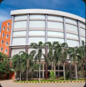

# Ex04 Places Around Me
## Date: 14/11/2025

## AIM
To develop a website to display details about the places around my house.

## DESIGN STEPS

### STEP 1
Create a Django admin interface.

### STEP 2
Download your city map from Google.

### STEP 3
Using ```<map>``` tag name the map.

### STEP 4
Create clickable regions in the image using ```<area>``` tag.

### STEP 5
Write HTML programs for all the regions identified.

### STEP 6
Execute the programs and publish them.

## CODE
'''
home
<!DOCTYPE html>
<html lang="en">
<head>
    <meta charset="UTF-8">
    <meta name="viewport" content="width=device-width, initial-scale=1.0">
    <title>Document</title>
</head>
<body>
    <!-- Image Map Generated by http://www.image-map.net/ -->


<map name="image-map">
    <area target="" alt="SIMATS" title="SIMATS" href="hospital.html" coords="450,561,683,722" shape="rect">
    <area target="" alt="SEC" title="SEC" href="saveetha.html" coords="521,344,127" shape="circle">
    <area target="" alt="AMUSEMENT park" title="AMUSEMENT park" href="park.html" coords="1003,199,1167,204,1230,301,1136,325,1014,314" shape="poly">
</map>
    
</body>
</html>
hospital
<!DOCTYPE html>
<html lang="en">
<head>
    <meta charset="UTF-8">
    <meta name="viewport" content="width=device-width, initial-scale=1.0">
    <title>Document</title>
</head>
<body bgcolor="cyan"text="red">
    
    <p>
        Saveetha Medical College & Hospital (SMCH) in Chennai is a large, 
        teaching hospital on a sprawling campus, known for providing affordable,
         evidence-based healthcare with advanced technology (like 128-slice CT, MRI, advanced OTs) and 
         a large team of specialists
    </p>
</body>
    
</body>
</html>
park
<!DOCTYPE html>
<html lang="en">
<head>
    <meta charset="UTF-8">
    <meta name="viewport" content="width=device-width, initial-scale=1.0">
    <title>Document</title>
</head>
<body bgcolor="cyan" text="red">
    
    <p>
        Saveetha Engineering College (SEC), established 2001 in Chennai, is an autonomous institution affiliated with Anna University, 
        known for its strong infrastructure, experienced faculty, AI/Data Science focus (NVIDIA H100 integration), and good placements, 
        holding NAAC 'A' Grade and NBA accreditation for several programs, 
        aiming to foster industry-ready engineers through practical learning and research. 
    </p>
</body>    
</body>
</html>
saveetha
<!DOCTYPE html>
<html lang="en">
<head>
    <meta charset="UTF-8">
    <meta name="viewport" content="width=device-width, initial-scale=1.0">
    <title>Document</title>
</head>
<body bgcolor="cyan" text="red">
    
    <p>
        an Australian state known as the "Sunshine State" for its warm climate,
         diverse natural landscapes, and extensive coastline along the Coral and Pacific Oceans.
          It is the second-largest and third-most populous state in Australia,
           with a population concentrated in the capital city of Brisbane and the southeast corner
    </p>
</body>
    
</body>
</html>
'''
## OUTPUT


## RESULT

The program for implementing image maps using HTML is executed successfully.
